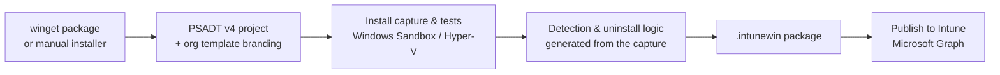

# win32-toolkit

**End-to-end Win32 app packaging for Microsoft Intune.** Point it at a winget package (or your own
installer), and it builds a branded [PSAppDeployToolkit v4](https://psappdeploytoolkit.com/) project,
installs the app in a disposable Windows Sandbox / Hyper-V guest to **capture what the installer
really does**, generates the Intune detection & uninstall logic from that capture, tests the
install/uninstall/update paths, packages the `.intunewin`, and publishes it to Intune — dependencies,
icon, and requirement rules included.

Built for Intune admins and packagers. The primary experience is a guided, menu-driven console UI
(`Show-Win32Toolkit`); every step is also scriptable through 14 PowerShell commands.



## Requirements

| Requirement | Notes |
|---|---|
| Windows 11 (Pro/Enterprise/Education for Sandbox) | Windows Sandbox is not available on Home |
| PowerShell 7.2+ | `winget install Microsoft.PowerShell` |
| winget | For the winget packaging flow (manual apps work without it) |
| Windows Sandbox **or** Hyper-V | Sandbox: `Enable-WindowsOptionalFeature -Online -FeatureName 'Containers-DisposableClientVM'` + reboot. Hyper-V backend: see [the Hyper-V test VM](docs/hyperv-vm.md) |
| Internet access | winget downloads, PSADT, tool downloads |
| Admin rights | Enabling features; the Hyper-V backend needs an elevated session |

Installed automatically on first use: PSAppDeployToolkit v4, PwshSpectreConsole (the UI),
Microsoft.Graph.Authentication (publishing), IntuneWinAppUtil.exe (packaging).

## Install

```powershell
# Option A — clone
git clone https://github.com/MG-Cloudflow/win32-toolkit.git
cd win32-toolkit

# Option B — download the ZIP from GitHub, then unblock it before extracting:
#   Right-click the .zip -> Properties -> Unblock  (or)
Unblock-File .\win32-toolkit-main.zip
```

```powershell
# Import and verify (from the repo folder)
Import-Module .\win32-toolkit.psd1
Get-Command -Module win32-toolkit
```

## Quickstart

> ~5 minutes of your input; the install capture then runs unattended (10–20 min for a typical app).

1. **Launch the UI** — double-click `Launch-Win32Toolkit.cmd`, or run `Show-Win32Toolkit` in
   PowerShell 7. The first screen is a **prerequisite health check** that tells you exactly what's
   missing and how to fix it.
2. **First-run setup** — you're asked once for a base folder (where all projects/output live) and
   walked through creating your first **org template** (your branding + defaults — see
   [org templates](docs/org-templates.md)).
3. **Package an app** — choose *Package a winget app*, search for `Git.Git`, pick the architecture,
   and let it run: download → project scaffold → the Sandbox opens and captures the install →
   detection & uninstall logic are generated from what the installer actually did.
4. **Find your package** — `<BasePath>\IntuneWin\<Template>\Git_x64_<version>.intunewin`, ready for
   Intune (or publish straight from the menu — needs an Intune admin account, see
   [publishing](docs/publishing.md)).

The same thing as one command:

```powershell
Invoke-Win32Toolkit -Id 'Git.Git' -Architecture x64 -Force -RunTest InstallUninstall -PackageIntune
```

Full walkthrough with what-you'll-see at every step: **[Getting started](docs/getting-started.md)**.

## Where things land

```
<BasePath>\                      chosen on first run (saved; override with -BasePath / -Reconfigure)
├── Templates\<name>.json        org templates (branding + defaults)
├── Projects\<Template>\<App>\   the source of truth — never modified by packaging
├── Staging\<Template>\<App>\    cleaned working copy used to build the package
├── IntuneWin\<Template>\        finished .intunewin files
└── Cache\                       download cache (re-runs skip re-downloading)
```

Projects are named `<AppName>_<arch>_<version>` and grouped per org template, so the same app can be
packaged for multiple customers side by side. Details: [concepts](docs/concepts.md).

## Commands

**Start here**

| Command | What it does |
|---|---|
| [Show-Win32Toolkit](docs/reference/Show-Win32Toolkit.md) | The guided console UI over everything below |
| [Invoke-Win32Toolkit](docs/reference/Invoke-Win32Toolkit.md) | Full winget pipeline in one command |
| [New-Win32ToolkitManualApp](docs/reference/New-Win32ToolkitManualApp.md) | Package an app that isn't in winget — [guide](docs/manual-apps.md) |
| [Complete-Win32ToolkitManualApp](docs/reference/Complete-Win32ToolkitManualApp.md) | Finish an advanced manual app after authoring its install |
| [Test-Win32ToolkitProject](docs/reference/Test-Win32ToolkitProject.md) | Install/uninstall & update tests in Sandbox or Hyper-V — [guide](docs/testing.md) |

**Pipeline steps**

| Command | What it does |
|---|---|
| [Export-Win32ToolkitIntuneWin](docs/reference/Export-Win32ToolkitIntuneWin.md) | Package a project into a `.intunewin` — [guide](docs/packaging.md) |
| [Publish-Win32ToolkitIntuneApp](docs/reference/Publish-Win32ToolkitIntuneApp.md) | Upload to Intune via Graph — [guide](docs/publishing.md) |
| [Export-Win32ToolkitDocumentation](docs/reference/Export-Win32ToolkitDocumentation.md) | Customer-facing one-pager for a packaged app |
| [Set-Win32ToolkitAppDependency](docs/reference/Set-Win32ToolkitAppDependency.md) | Declare app dependencies — [guide](docs/dependencies.md) |
| [Sync-Win32ToolkitAppDependency](docs/reference/Sync-Win32ToolkitAppDependency.md) | Re-attach dependencies on already-published apps |

**Hyper-V test VM** (optional faster backend — [guide](docs/hyperv-vm.md))

| Command | What it does |
|---|---|
| [New-Win32ToolkitTestVM](docs/reference/New-Win32ToolkitTestVM.md) | One-time VM provisioning (ISO or your own VHDX) |
| [Set-Win32ToolkitTestVMResource](docs/reference/Set-Win32ToolkitTestVMResource.md) | Change the VM's CPU/RAM |
| [Reset-Win32ToolkitTestVM](docs/reference/Reset-Win32ToolkitTestVM.md) | Revert the VM to its clean checkpoint |
| [Remove-Win32ToolkitTestVM](docs/reference/Remove-Win32ToolkitTestVM.md) | Delete the VM |

## Documentation

Guides, concepts, configuration, and the full command reference live in **[docs/](docs/README.md)** —
also published as a browsable site via GitHub Pages. Offline: `Get-Help <command> -Full`.

## License

See [LICENSE](LICENSE).
