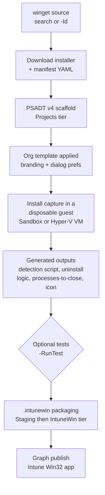
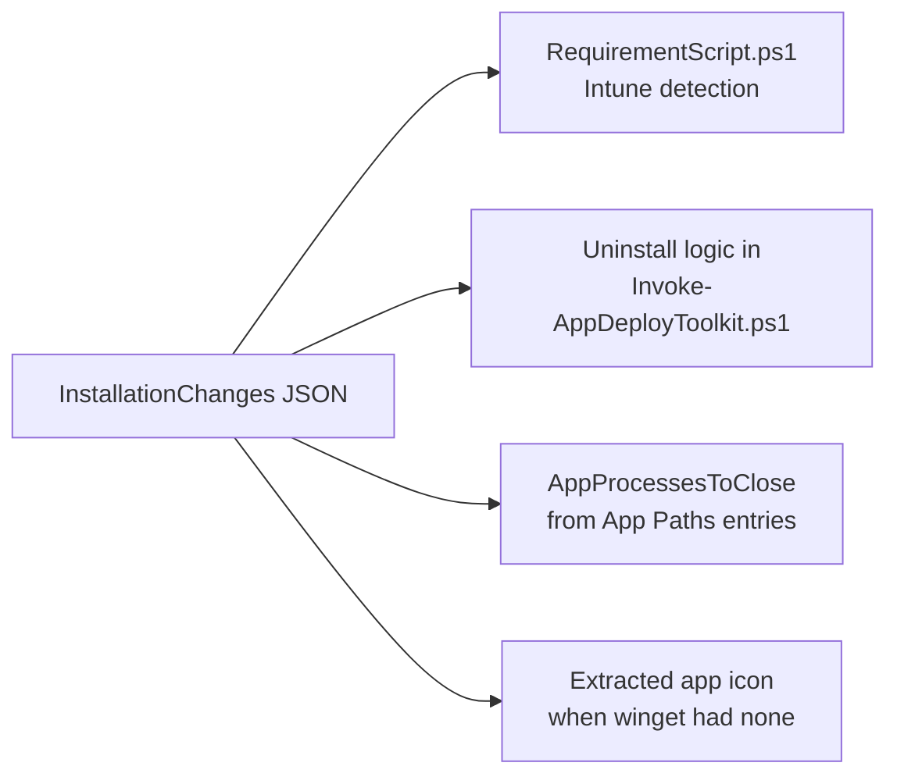

# Concepts — how it all fits together

This page explains the moving parts of win32-toolkit: what the pipeline actually does from
"I typed a winget ID" to "the app is in Intune", where every file lands on disk, what each file
in a project is for, and how the detection and uninstall logic gets written for you.

If you want a hands-on walkthrough instead, start with [Getting started](getting-started.md).
For every parameter of every command, see the [command reference](reference/README.md).

## The pipeline

One command — [Invoke-Win32Toolkit](reference/Invoke-Win32Toolkit.md) — drives the whole flow:



Each step in one honest sentence:

| # | Step | What really happens |
|---|---|---|
| 1 | Winget check | Confirms `winget` is installed and answering before anything else runs. |
| 2 | Template load | Loads your org template, or walks you through creating one if none exists. |
| 3 | App resolution | Resolves the package interactively from a search, or directly by winget ID. |
| 4 | Architecture selection | Picks x64/x86/arm64 from a menu, or from the parameter if you passed one. |
| 5 | PSADT project creation | Scaffolds a fresh PSAppDeployToolkit v4 project under `Projects\`. |
| 6 | Download | Runs `winget download` into the project's `Files\` folder, manifest included. |
| 7 | File rename | Normalises the installer filename to `AppName_arch_version.ext`. |
| 8 | PSADT configuration | Detects MSI / EXE / MSIX and writes the matching install logic into `Invoke-AppDeployToolkit.ps1`. |
| 9 | Org template application | Stamps your branding and dialog preferences into `Config\`, `Strings\`, and the deploy script. |
| 10 | Icon download | Fetches the winget `IconUrl` to `Assets\AppIcon.png` when the manifest has one. |
| 11 | Install capture | Installs the app inside a disposable guest (Windows Sandbox by default, Hyper-V VM if configured) and records what changed. |
| 12 | Result processing | Turns the capture into a detection script, EXE uninstall logic, processes-to-close, and — if winget had no icon — the app's real icon. |
| 13 | Tests (optional) | `-RunTest` replays install/uninstall or an update-from-older-version scenario in a fresh guest. |
| 14 | Packaging (optional) | `-PackageIntune` copies the project to `Staging\`, cleans it, and runs `IntuneWinAppUtil.exe` to produce the `.intunewin`. |
| 15 | Publish (optional) | `-PublishIntune` uploads the package to Intune via Microsoft Graph, detection rule and tile icon included. |

The guest is always disposable: Windows Sandbox throws its state away on close, and the Hyper-V
backend reverts the VM to a clean checkpoint — so every capture and test starts from a machine
that has never seen the app.

### Two guest backends, one contract

Captures and tests run in one of two disposable guests. Which one is a per-machine choice stored
in the same registry key as BasePath (`HKCU:\Software\CloudFlow\win32-toolkit`, value
`TestBackend`):

| Backend | What it is | When to prefer it |
|---|---|---|
| **Windows Sandbox** (default) | The built-in throwaway Windows container; the project folder is mapped into the guest as `C:\PSADT`, and state is discarded on close. | Zero setup — works on any Windows machine with the Sandbox feature enabled. |
| **Hyper-V VM** | A dedicated test VM (created once with [New-Win32ToolkitTestVM](reference/New-Win32ToolkitTestVM.md)) that reverts to a clean checkpoint before every run. | Faster repeated runs and richer test scenarios; falls back to Sandbox automatically when the VM is not ready. |

Both backends run the *same* capture script and the same test scenarios, and both can run
**unattended** — silent, back-to-back, no GUI or countdown — either per call or as a saved
default. The outputs (the capture JSON, logs, test results) are identical either way, so
everything downstream of the capture is backend-agnostic.

## The folder layout

Everything the toolkit produces lives under a single **BasePath**, split into four tiers and
grouped **by org template** — so the same app can be packaged for multiple clients side by side:

```
C:\Win32Apps\                            BasePath (saved in the registry)
  Templates\
    Contoso.json                         org template — branding + PSADT dialog prefs
  Projects\
    Contoso\                             template the project was built with
      Git_x64_2.53.0\                    raw project — never modified after creation
        Invoke-AppDeployToolkit.ps1      the PSADT deployment script
        Files\                           installer + winget manifest
        SupportFiles\                    AppConfig.json, RequirementScript.ps1
        Config\  Strings\  Assets\       branding, messages, AppIcon.png
        Documentation\                   install-capture JSON and log
        Sandbox\                         test artifacts — never shipped
  Staging\
    Contoso\
      Git_x64_2.53.0\                    cleaned working copy made during packaging
  IntuneWin\
    Contoso\
      Git_x64_2.53.0.intunewin           ready-to-upload Intune package
```

Two invariants hold everywhere:

**BasePath is registry-backed.** On first run the toolkit prompts for the folder and saves it to
`HKCU:\Software\CloudFlow\win32-toolkit`. After that you never type it again. To use a different
location for a single call, pass `-BasePath`; to change the saved value, pass `-Reconfigure` and
the prompt returns.

(When the pipeline cache is on, a fifth folder — `Cache\winget\` — holds re-downloadable
installers for update-test baselines; every cached file is hash-checked against the winget
manifest before reuse, so a stale or tampered entry is simply re-downloaded.)

**`Projects\` is never modified during packaging.** The project folder is your source of truth —
capture results, test artifacts, and your own manual edits live there. When you package, the
toolkit copies the project to `Staging\`, and all cleanup (stripping test artifacts, capture
documentation, and anything else that must not ship) happens only on that staging copy. If a
package ever looks wrong, the raw project is still intact.

## Anatomy of a project

What each item inside `Projects\<Template>\<AppName_arch_version>\` is for:

| Item | Purpose |
|---|---|
| `Invoke-AppDeployToolkit.ps1` | The PSADT v4 deployment script — install, uninstall, and repair logic, pre-configured for your installer type. This is what runs on the device. |
| `Files\` | The downloaded installer (renamed to `AppName_arch_version.ext`) plus the winget manifest YAML the toolkit used to configure it. |
| `Assets\AppIcon.png` | The app's tile icon (see sourcing rules below). Feeds PSADT's on-device dialogs and is uploaded to Intune as the app tile at publish time. |
| `Config\config.psd1` | PSADT configuration — company name, accent colour, log path, and other branding from your org template. |
| `Strings\strings.psd1` | PSADT localisation strings — the progress and balloon messages from your org template. |
| `SupportFiles\RequirementScript.ps1` | A ready-to-paste Intune Win32 requirement script generated from the capture (see next section). |
| `SupportFiles\AppConfig.json` | Data-driven install/uninstall values the deploy script reads, instead of hard-coding them into generated code. |
| `Documentation\` | The install-capture output — `InstallationChanges_<timestamp>.json` and its log. This is the raw material the generators work from. |
| `Sandbox\` | Test artifacts: `.wsb` configs, the countdown script, `Logs\`, and `OldVersion\` baselines for update tests. **Never ships** — stripped from the staging copy before packaging. |
| `<ProjectName>_TargetedDocumentation.wsb` | The Windows Sandbox config for the capture run — double-click it to re-run the documentation session by hand. |

### Where the icon comes from

The tile icon is sourced in a fixed order of preference:

1. **Winget `IconUrl`** — if the manifest declares one, it wins and is downloaded at build time.
2. **Extracted from the install capture** — if winget had no icon, the capture run pulls the
   installed app's real icon: from the Add/Remove Programs `DisplayIcon` value first, otherwise
   from the largest `.exe` in the install directory. That icon is promoted to `Assets\AppIcon.png`
   during result processing — this is how manual and iconless apps still get a real tile.
3. **Manual `-IconPath`** — for manual apps, an icon you supply explicitly always wins over both.

Low-resolution frames (48px or smaller) are skipped rather than upscaled. If nothing usable is
found, the default PSADT icon stays in place and the app publishes without a tile icon.

## How detection & uninstall are generated

This is the part that saves the most manual work, and it all comes from one idea: **diff a clean
machine before and after the install**.

The capture script runs inside the disposable guest and snapshots, before and after the installer:

- the **registry Uninstall hives** (Add/Remove Programs entries, both 64- and 32-bit views, and
  the user hive when the installer is user-scoped),
- **targeted file-system locations** (Program Files, ProgramData, and the profile roots),
- the list of **Windows services**.

Whatever appears only in the *after* snapshot was put there by this app. The diff is written to
`Documentation\InstallationChanges_<timestamp>.json`, and the generators turn it into:



**Detection** — `SupportFiles\RequirementScript.ps1` checks the Uninstall hives for the app's
**exact `DisplayName`** and, when available, its **MSI product code**, then compares versions.
Matching is deliberately strict: exact name equality, never a partial or first-word match, so
"Microsoft Teams" can never be "detected" because Microsoft Edge happens to be installed.

**Uninstall** depends on the installer type:

| Installer type | Uninstall strategy |
|---|---|
| **MSI** | PSADT's **Zero-Config MSI**: `AppName` is left empty, PSADT reads the product name and product code straight from the MSI database and uninstalls via `msiexec`. No generated code needed. |
| **EXE** | The capture's new Uninstall key supplies the `UninstallString` / `QuietUninstallString`, and the toolkit writes matching uninstall logic into `Invoke-AppDeployToolkit.ps1` — this is the case that genuinely needs the capture. |
| **MSIX / APPX** | Uninstall is **identity-driven**: the package identity is read from the package manifest at configure time and removed via the Appx cmdlets — written before any capture runs. |

Two more things fall out of the same diff: any new **App Paths** registry entries become the
PSADT `AppProcessesToClose` list (so an open app is closed gracefully before install/uninstall),
and the **services** the app registered are recorded in the documentation for troubleshooting.

Because the guest starts clean every time, the diff contains only what *this* installer did — no
noise from previously installed software. That is why the capture runs in a disposable guest and
not on your admin workstation.

<!-- SCREENSHOT: Windows Sandbox window during a capture run, showing the targeted documentation script logging its pre/post snapshots -->

Everything the generators emit is plain PowerShell inside the project — open
`RequirementScript.ps1` or the uninstall section of `Invoke-AppDeployToolkit.ps1` and read
exactly what will run on the device before you package it.

## Apps that are not on winget

The pipeline above assumes winget knows the app. When it does not — bespoke line-of-business
installers, vendor downloads behind a login — the same machinery still applies, just with a
different front door:

1. [New-Win32ToolkitManualApp](reference/New-Win32ToolkitManualApp.md) scaffolds the same PSADT
   project structure from an installer file you supply, prompting for the metadata winget would
   normally provide (name, version, publisher, silent switches).
2. [Complete-Win32ToolkitManualApp](reference/Complete-Win32ToolkitManualApp.md) then runs the
   back half of the pipeline — the install capture, the generated detection and uninstall logic,
   and optionally tests, packaging, and publishing.

From the capture step onward a manual app is indistinguishable from a winget app: same folder
tiers, same generated files, same `.intunewin` output. This is also where `-IconPath` matters
most, since there is no winget manifest to supply an icon.

## Dependencies between apps

An app can declare other toolkit projects as dependencies (for example, a runtime it needs).
[Set-Win32ToolkitAppDependency](reference/Set-Win32ToolkitAppDependency.md) records the link on
the project; during captures and tests the dependencies are installed into the guest *before*
the baseline snapshot is taken, so the dependency's files, registry keys, and services never
pollute the app's own diff. At publish time,
[Sync-Win32ToolkitAppDependency](reference/Sync-Win32ToolkitAppDependency.md) mirrors the
relationships into Intune so the service installs things in the right order.
