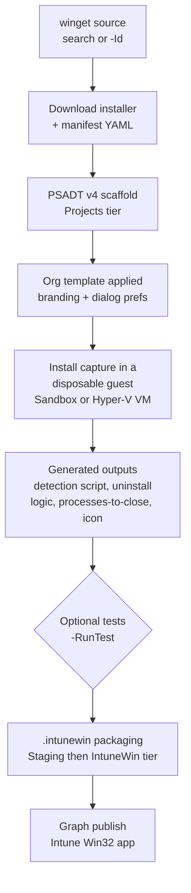
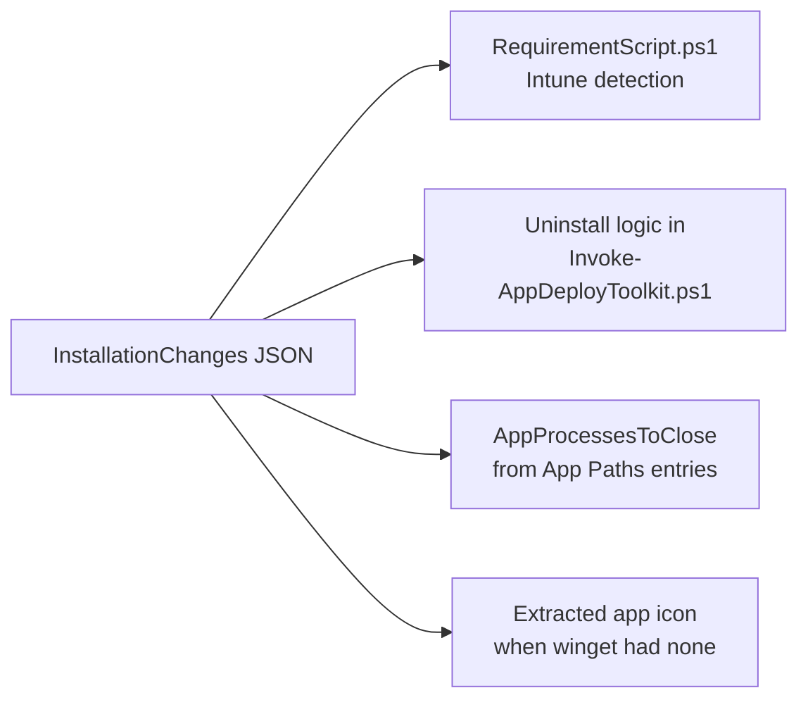

# Concepts — how it all fits together

This page explains the moving parts of win32-toolkit: what the pipeline actually does from
"I typed a winget ID" to "the app is in Intune", where every file lands on disk, what each file
in a project is for, and how the detection and uninstall logic gets written for you.

If you want a hands-on walkthrough instead, start with [Getting started](getting-started.md).
For every parameter of every command, see the [command reference](reference/README.md).

## The pipeline

One command — [Invoke-Win32Toolkit](reference/Invoke-Win32Toolkit.md) — drives the whole flow:



Each step in one honest sentence:

| # | Step | What really happens |
|---|---|---|
| 1 | Winget check | Confirms `winget` is installed and answering before anything else runs. |
| 2 | Template load | Loads your org template, or walks you through creating one if none exists. |
| 3 | App resolution | Resolves the package interactively from a search, or directly by winget ID. |
| 4 | Architecture selection | Picks x64/x86/arm64 from a menu, or from the parameter if you passed one. |
| 5 | PSADT project creation | Scaffolds a fresh PSAppDeployToolkit v4 project under `Projects\`. |
| 6 | Download | Runs `winget download` into the project's `Files\` folder, manifest included. |
| 7 | File rename | Normalises the installer filename to `AppName_arch_version.ext`. |
| 8 | PSADT configuration | Detects MSI / EXE / MSIX and writes the matching install logic into `Invoke-AppDeployToolkit.ps1`. |
| 9 | Org template application | Stamps your branding and dialog preferences into `Config\`, `Strings\`, and the deploy script. |
| 10 | Icon download | Fetches the winget `IconUrl` to `Assets\AppIcon.png` when the manifest has one. |
| 11 | Install capture | Installs the app inside a disposable guest (Windows Sandbox by default, Hyper-V VM if configured) and records what changed. |
| 12 | Result processing | Turns the capture into a detection script, EXE uninstall logic, processes-to-close, and — if winget had no icon — the app's real icon. |
| 13 | Tests (optional) | `-RunTest` replays install/uninstall or an update-from-older-version scenario in a fresh guest. |
| 14 | Packaging (optional) | `-PackageIntune` copies the project to `Staging\`, cleans it, and runs `IntuneWinAppUtil.exe` to produce the `.intunewin`. |
| 15 | Publish (optional) | `-PublishIntune` uploads the package to Intune via Microsoft Graph, detection rule and tile icon included. |

The guest is always disposable: Windows Sandbox throws its state away on close, and the Hyper-V
backend reverts the VM to a clean checkpoint — so every capture and test starts from a machine
that has never seen the app.

### Two guest backends, one contract

Captures and tests run in one of two disposable guests. Which one is a per-machine choice stored
in the same registry key as BasePath (`HKCU:\Software\CloudFlow\win32-toolkit`, value
`TestBackend`):

| Backend | What it is | When to prefer it |
|---|---|---|
| **Windows Sandbox** (default) | The built-in throwaway Windows container; the project folder is mapped into the guest as `C:\PSADT`, and state is discarded on close. | Zero setup — works on any Windows machine with the Sandbox feature enabled. |
| **Hyper-V VM** | A dedicated test VM (created once with [New-Win32ToolkitTestVM](reference/New-Win32ToolkitTestVM.md)) that reverts to a clean checkpoint before every run. | Faster repeated runs and richer test scenarios; falls back to Sandbox automatically when the VM is not ready. |

Both backends run the *same* capture script and the same test scenarios, and both can run
**unattended** — silent, back-to-back, no GUI or countdown — either per call or as a saved
default. The outputs (the capture JSON, logs, test results) are identical either way, so
everything downstream of the capture is backend-agnostic.

## The folder layout

Everything the toolkit produces lives under a single **BasePath**, split into four tiers and
grouped **by org template** — so the same app can be packaged for multiple clients side by side:

```
C:\Win32Apps\                            BasePath (saved in the registry)
  Templates\
    Contoso.json                         org template — branding + PSADT dialog prefs
  Projects\
    Contoso\                             template the project was built with
      Git_x64_2.53.0\                    raw project — never modified after creation
        Invoke-AppDeployToolkit.ps1      the PSADT deployment script
        Files\                           installer + winget manifest
        SupportFiles\                    AppConfig.json, RequirementScript.ps1
        Config\  Strings\  Assets\       branding, messages, AppIcon.png
        Documentation\                   install-capture JSON and log
        Sandbox\                         test artifacts — never shipped
  Staging\
    Contoso\
      Git_x64_2.53.0\                    cleaned working copy made during packaging
  IntuneWin\
    Contoso\
      Git_x64_2.53.0.intunewin           ready-to-upload Intune package
```

Two invariants hold everywhere:

**BasePath is registry-backed.** On first run the toolkit prompts for the folder and saves it to
`HKCU:\Software\CloudFlow\win32-toolkit`. After that you never type it again. To use a different
location for a single call, pass `-BasePath`; to change the saved value, pass `-Reconfigure` and
the prompt returns.

(When the pipeline cache is on, a fifth folder — `Cache\winget\` — holds re-downloadable
installers for update-test baselines; the cached installer is SHA256-checked against its winget
manifest before every reuse, so a stale or tampered entry is simply re-downloaded.)

**`Projects\` is never modified during packaging.** The project folder is your source of truth —
capture results, test artifacts, and your own manual edits live there. When you package, the
toolkit copies the project to `Staging\`, and all cleanup (stripping test artifacts, capture
documentation, and anything else that must not ship) happens only on that staging copy. If a
package ever looks wrong, the raw project is still intact.

## Anatomy of a project

What each item inside `Projects\<Template>\<AppName_arch_version>\` is for:

| Item | Purpose |
|---|---|
| `Invoke-AppDeployToolkit.ps1` | The PSADT v4 deployment script — install, uninstall, and repair logic, pre-configured for your installer type. This is what runs on the device. |
| `Files\` | The downloaded installer (renamed to `AppName_arch_version.ext`) plus the winget manifest YAML the toolkit used to configure it. |
| `Assets\AppIcon.png` | The app's tile icon (see sourcing rules below). Feeds PSADT's on-device dialogs and is uploaded to Intune as the app tile at publish time. |
| `Config\config.psd1` | PSADT configuration — company name, accent colour, log path, and other branding from your org template. |
| `Strings\strings.psd1` | PSADT localisation strings — the progress and balloon messages from your org template. |
| `SupportFiles\RequirementScript.ps1` | A ready-to-paste Intune Win32 requirement script generated from the capture (see next section). |
| `SupportFiles\AppConfig.json` | Data-driven install/uninstall values the deploy script reads, instead of hard-coding them into generated code. |
| `Documentation\` | The install-capture output — `InstallationChanges_<timestamp>.json` and its log. This is the raw material the generators work from. |
| `Sandbox\` | Test artifacts: `.wsb` configs, the countdown script, `Logs\`, and `OldVersion\` baselines for update tests. **Never ships** — stripped from the staging copy before packaging. |
| `<ProjectName>_TargetedDocumentation.wsb` | The Windows Sandbox config for the capture run — double-click it to re-run the documentation session by hand. |

### Where the icon comes from

The tile icon is sourced in a fixed order of preference — the first one that exists wins:

1. **An app-specific icon you or winget supplied** — the winget manifest's `IconUrl` for a winget app,
   or your `-IconPath` for a manual app. A project only ever has one of the two (they come from
   different entry points), and both are treated as authoritative: nothing below overrides them.
2. **Extracted from the install capture** — if there is no icon above, the capture run pulls the
   installed app's real icon: from the Add/Remove Programs `DisplayIcon` value first, otherwise from
   the largest `.exe` in the install directory. This is how an iconless **MSI or EXE** still gets a
   real tile. It does **not** help an MSIX — a package writes no Add/Remove Programs entry for the
   capture to read.
3. **Your org template's logo** — `Templates\<name>\Assets\AppIcon.png`, if the template ships one
   **and has custom assets enabled** (see [Org templates](org-templates.md)). This is the floor: every
   app-specific icon above beats it, but when an app has no icon of its own, the tile shows *your*
   logo instead of a generic one. For MSIX this is usually the one that matters.
4. **The PSADT default logo** — only if you ship none of the above.

A size note for **captured** icons only: `.ico` and raster sources skip frames smaller than 48px
rather than upscaling them, but an icon pulled out of an `.exe` is always rendered at 256×256 — so a
low-resolution EXE icon can come out upscaled and soft. Icons from winget or `-IconPath` are taken as
given, at whatever size they are.

Whatever ends up at `Assets\AppIcon.png` is what publishes as the Intune tile — replace the file
before publishing if you want a different one.

## Installer types: `.msi`, `.exe`, `.msix` / `.appx`

The toolkit picks the installer out of `Files\` **by extension**, in this order of precedence:

```
.msi  >  .exe  >  .msix / .msixbundle  >  .appx / .appxbundle
```

If several candidates of the same kind are present it takes the first by name **and says so in a
warning** — nothing inspects file contents to guess which binary is "the real installer". (This
matters for packages: `winget download` fetches an app's framework dependencies into `Files\`
alongside it, so a `VCLibs` package can sit next to your app.)

The type decides three things: how the app installs, whether silent switches are needed at all, and
**where the uninstall comes from**.

| | `.msi` | `.exe` | `.msix` / `.appx` |
|---|---|---|---|
| **Installs via** | PSADT Zero-Config MSI | your silent switches | `Add-AppxProvisionedPackage` (SYSTEM) / `Add-AppxPackage` (interactive) |
| **Silent switches** | not needed | **required** — the only type that needs them | not applicable |
| **Uninstall comes from** | PSADT Zero-Config — the MSI itself | **the install capture** → the `UninstallString` | the **package manifest**, read at configure time |
| **Needs the capture to uninstall** | no | **yes** | no |

That last row is the one to remember: **`.exe` is the only type whose uninstall depends on the
capture.** An MSI is removed by PSADT from the MSI itself, and an MSIX by its package identity — both
work even if a capture run finds nothing.

### `.msi` — Zero-Config

The toolkit deliberately leaves the PSADT `AppName` empty for an MSI, which keeps PSADT's
**Zero-Config MSI** behaviour switched on: PSADT finds the MSI in `Files\` and drives both the install
and the uninstall itself. `Installer.SilentArgs` is written empty and **no `Uninstall` section is
created at all** — Zero-Config already knows what to do, so there is nothing for the capture to
contribute.

### `.exe` — the only type that needs switches

An EXE is opaque, so the toolkit has to be told how to install it quietly. Where that comes from
depends on which pipeline you are in:

**Winget apps** take the switches from the manifest's `InstallerSwitches.Silent`. If the manifest
doesn't declare any, the toolkit falls back to `/S` — **silently, and `/S` is only a guess.** It is
right for NSIS installers and wrong for plenty of others (Inno Setup wants `/VERYSILENT`). The winget
`InstallerType` is *not* consulted here, so if an install misbehaves, check
`SupportFiles\AppConfig.json` → `Installer.SilentArgs` first and correct it there — it is data, not
code.

**Manual apps** use the `-SilentArgs` you pass. If you don't pass any, there is no guess: the app
becomes an **Advanced ("hard") app** and you author the Install region of the deploy script yourself.
The rest of the pipeline still applies. See [Manual apps](manual-apps.md). (Advanced mode exists only
in the manual flow — a winget EXE never becomes one; it gets the `/S` guess instead.)

The uninstall is read out of the capture — the `UninstallString` of the Add/Remove Programs entry the
installer created. If that string is an `msiexec` command, its ProductCode is used.

### `.msix` / `.appx` — including bundles

Packages are the odd one out, and the differences are worth knowing:

- **No silent switches exist.** MSIX installation is standardised, so there is nothing to pass.
- **Two install paths.** As SYSTEM (how Intune runs it) the package is *provisioned* for all users
  with `Add-AppxProvisionedPackage -Regions 'all'`. Interactively — the sandbox test run — it is
  registered for the current user with `Add-AppxPackage`, so you can actually see the app.
- **The uninstall does not come from the capture.** It *can't*: MSIX is registry-virtualised and
  installs into `%ProgramFiles%\WindowsApps\`, so it writes no Add/Remove Programs entry, no
  `App Paths` key, and no `InstallLocation` — the very things the capture looks for. Instead the
  toolkit reads the **package identity** straight out of `AppxManifest.xml` at configure time and
  uninstalls by name. The same applies to the processes to close, which come from the manifest's
  `<Application Executable="…">` entries.
- **This means an MSIX gets a working uninstall even if the capture finds nothing** — by design.
- **Bundles are supported** (`.msixbundle` / `.appxbundle`). They install and uninstall exactly like a
  single package. Note that **the file extension lies**: winget names a download after the
  *declared* `InstallerType`, so Microsoft's PowerShell package — a `.msixbundle` — arrives called
  `.msix`. The toolkit detects bundles by **content**, never by extension.
- **Minimum OS is raised to 1809** for packages when publishing (MSIX needs 1709, and provisioning
  with `-Regions` needs 1803). A higher value you set is never lowered.

!!! warning "MSIX must be signed, and the certificate must be trusted"

    Windows will not install an unsigned MSIX — not even through Intune. This is a property of MSIX
    itself, not of this toolkit, and there is nothing the packaging step can do about it.

    - **From winget** (e.g. PowerShell, Windows Terminal): already signed with a CA-trusted
      certificate. Nothing to do.
    - **Your own LOB package**: sign it. With a CA-trusted certificate (e.g. Azure Artifact Signing)
      Windows trusts it automatically. With a **self-signed** certificate you must also push the
      public key to your devices — an Intune **Trusted certificate** profile with the destination
      store set to **Local Computer – Trusted People** — and it must land **before** the app does, or
      the install fails.

### Detection prefers the tattoo — for every type

Whatever the installer, detection *prefers* the **install tattoo** described in the next section — a
registry value the deploy script writes itself. That is deliberate: it is the one signal that behaves
identically for an MSI, an EXE and an MSIX.

The tattoo needs five things: an **author** (which only an org template supplies, via
`AppScriptAuthor`), a **publisher/vendor**, a **name**, a **version**, and the tattoo block must
actually be present in the deploy script — a project scaffolded before the tattoo existed has the
values but not the code. If anything is missing the toolkit **warns, naming the missing field**, and
falls back to capture-based rules.

!!! warning "For MSIX, the fallback has nothing to fall back on"

    Capture-based rules are built from what the installer wrote to the registry and disk — and as
    described above, an MSIX writes none of it. So a package with no tattoo can end up with **no
    detection rule at all**, which Intune treats as "never installed" and re-runs forever.

    The toolkit warns about this at publish time — but it is only a warning: **the app is created
    anyway**, and by the time you see it the upload is already under way. You would then have to add a
    detection rule by hand in the Intune portal, or re-package.

    In practice: always package MSIX with an org template that sets an app-script author, and treat
    "no detection rules found" as something to fix *before* you publish, not after.

## How detection & uninstall are generated

This is the part that saves the most manual work, and it all comes from one idea: **diff a clean
machine before and after the install**.

The capture script runs inside the disposable guest and snapshots, before and after the installer:

- the **registry Uninstall hives** (Add/Remove Programs entries, both 64- and 32-bit views, and
  the user hive when the installer is user-scoped),
- **targeted file-system locations** (Program Files, ProgramData, and the profile roots),
- the list of **Windows services**.

Whatever appears only in the *after* snapshot was put there by this app. The diff is written to
`Documentation\InstallationChanges_<timestamp>.json`, and the generators turn it into:



**Detection** — `SupportFiles\RequirementScript.ps1` checks the Uninstall hives for the app's
**exact `DisplayName`** and, when available, its **MSI product code**, then compares versions.
Matching is deliberately strict: exact name equality, never a partial or first-word match, so
"Microsoft Teams" can never be "detected" because Microsoft Edge happens to be installed.

**Uninstall** depends on the installer type:

| Installer type | Uninstall strategy |
|---|---|
| **MSI** | PSADT's **Zero-Config MSI**: `AppName` is left empty, PSADT reads the product name and product code straight from the MSI database and uninstalls via `msiexec`. No generated code needed. |
| **EXE** | The capture's new Uninstall key supplies the `UninstallString` / `QuietUninstallString`, and the toolkit writes matching uninstall logic into `Invoke-AppDeployToolkit.ps1` — this is the case that genuinely needs the capture. |
| **MSIX / APPX** | Uninstall is **identity-driven**: the package identity is read from the package manifest at configure time and removed via the Appx cmdlets — written before any capture runs. |

Two more things fall out of the same diff: any new **App Paths** registry entries become the
PSADT `AppProcessesToClose` list (so an open app is closed gracefully before install/uninstall),
and the **services** the app registered are recorded in the documentation for troubleshooting.

Because the guest starts clean every time, the diff contains only what *this* installer did — no
noise from previously installed software. That is why the capture runs in a disposable guest and
not on your admin workstation.

<!-- SCREENSHOT: Windows Sandbox window during a capture run, showing the targeted documentation script logging its pre/post snapshots -->

Everything the generators emit is plain PowerShell inside the project — open
`RequirementScript.ps1` or the uninstall section of `Invoke-AppDeployToolkit.ps1` and read
exactly what will run on the device before you package it.

## Apps that are not on winget

The pipeline above assumes winget knows the app. When it does not — bespoke line-of-business
installers, vendor downloads behind a login — the same machinery still applies, just with a
different front door:

1. [New-Win32ToolkitManualApp](reference/New-Win32ToolkitManualApp.md) scaffolds the same PSADT
   project structure from an installer file you supply, prompting for the metadata winget would
   normally provide (name, version, publisher, silent switches).
2. [Complete-Win32ToolkitManualApp](reference/Complete-Win32ToolkitManualApp.md) then runs the
   back half of the pipeline — the install capture, the generated detection and uninstall logic,
   and optionally tests, packaging, and publishing.

From the capture step onward a manual app is indistinguishable from a winget app: same folder
tiers, same generated files, same `.intunewin` output. This is also where `-IconPath` matters
most, since there is no winget manifest to supply an icon.

## Dependencies between apps

An app can declare other toolkit projects as dependencies (for example, a runtime it needs).
[Set-Win32ToolkitAppDependency](reference/Set-Win32ToolkitAppDependency.md) records the link on
the project; during captures and tests the dependencies are installed into the guest *before*
the baseline snapshot is taken, so the dependency's files, registry keys, and services never
pollute the app's own diff. At publish time
[Publish-Win32ToolkitIntuneApp](reference/Publish-Win32ToolkitIntuneApp.md) attaches the
relationships in Intune so the service installs things in the right order;
[Sync-Win32ToolkitAppDependency](reference/Sync-Win32ToolkitAppDependency.md) is the follow-up
tool for re-attaching them on apps that are already published.
