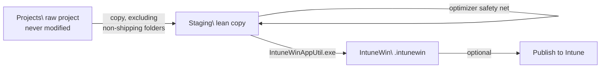

# Packaging a project into a `.intunewin`

[Export-Win32ToolkitIntuneWin](reference/Export-Win32ToolkitIntuneWin.md) compiles a finished PSADT project into the `.intunewin` file that Intune's Win32 app model requires. It never touches your raw project: everything happens on a disposable **Staging** copy, and the output lands in its own **IntuneWin** tier.

To package a project:

```powershell
# Interactive: pick a project from a numbered list
Export-Win32ToolkitIntuneWin

# Direct: point at the raw project folder
Export-Win32ToolkitIntuneWin -ProjectPath 'C:\Win32Apps\Projects\Contoso\Git_x64_2.53.0'
```

If you started from [Invoke-Win32Toolkit](reference/Invoke-Win32Toolkit.md) with `-PackageIntune`, this step runs automatically at the end of the pipeline.

## What happens, step by step



1. **Resolve the project.** Without `-ProjectPath`, a numbered picker scans `BasePath\Projects\`. With `-ProjectPath` but no `-BasePath`, the base folder is derived from the path. The project must sit in the `<BasePath>\Projects\<Template>\<ProjectName>` layout, otherwise the command stops and asks you to pass `-BasePath` explicitly rather than creating `Staging\` and `IntuneWin\` somewhere unexpected.
2. **Get the packaging tool.** See [IntuneWinAppUtil.exe](#intunewinapputilexe-auto-download-and-verification) below.
3. **Copy the project to Staging.** Only shipping content is copied (see the next section).
4. **Run the optimizer** on the Staging copy as a safety net.
5. **Build the package** with `IntuneWinAppUtil.exe` and rename the output to `<ProjectName>.intunewin`.
6. **Offer to publish** (see [Publishing straight after packaging](#publishing-straight-after-packaging)).

## The Staging copy: what ships and what never does

The raw project under `Projects\` is your source of truth and is **never modified during packaging**. Each run copies it fresh into `Staging\<Template>\<ProjectName>`, but the copy *excludes* the non-shipping folders up front, so they never exist in Staging at all:

| Excluded folder | Why it must not ship |
|---|---|
| `Sandbox\` | Test scaffolding: `.wsb` configs, countdown scripts, the old-version installer, dependency installers |
| `Documentation\` | Sandbox install-capture JSON and logs |
| `Intune\` | **Privacy:** holds `Publications.json`, your tenant id and Intune app ids. These must never travel to an end-user device |
| `Docs\`, `Examples\` | PSADT v4 boilerplate: pure package bloat |

Excluding at copy time (rather than copying everything and deleting afterwards) means the copy is smaller and faster, there is no freshly-written file for antivirus to lock mid-delete, and the tenant/app ids in `Intune\Publications.json` cannot leak into the package even if a later cleanup step were to fail.

### The optimizer safety net

After the copy, the optimizer runs on the Staging copy anyway. It is normally a no-op for the folders above, but it catches anything that slipped through and additionally removes:

- `*.md` and `*.wsb` files in the project root
- `SupportFiles\TargetedDocumentationScript*` and its log files (`SupportFiles\RequirementScript.ps1` is **kept**; Intune needs it)
- Any empty subdirectories

If a locked file prevents stripping a bloat folder, you get a warning and a slightly larger package. If the `Intune\` folder itself cannot be removed, packaging **refuses to continue**. A larger package is acceptable, leaked tenant ids are not.

## IntuneWinAppUtil.exe: auto-download and verification

The packager is Microsoft's official Win32 Content Prep Tool. On first use it is downloaded automatically into the module's `Tools\` folder (latest GitHub release first, raw repository file as fallback). No manual setup.

Because this binary is executed on your packaging machine, its **Authenticode signature is verified on every run**, both right after a download and for a copy that already sits in `Tools\`. The signature must be valid and issued to *Microsoft Corporation*; anything else is deleted on the spot so a rejected binary can never be silently reused. If the download fails, the error tells you where to fetch the tool manually and where to place it.

## Where the output lands

Output is grouped by [org template](org-templates.md), like every other tier:

```
C:\Win32Apps\
  Projects\
    Contoso\
      Git_x64_2.53.0\            raw project (Sandbox\, Documentation\, Intune\ intact)
  Staging\
    Contoso\
      Git_x64_2.53.0\            lean copy, kept after the run
  IntuneWin\
    Contoso\
      Git_x64_2.53.0.intunewin   ready to upload
```

## Re-packaging

Running the command again on the same project is always safe:

- The previous Staging copy is deleted (with retries for briefly AV-locked files) and rebuilt from the current raw project, so Staging always reflects your latest edits. If a file stays locked, the run fails loudly rather than packaging a stale, half-cleared copy.
- An existing `<ProjectName>.intunewin` is overwritten.

So the edit loop is simply: change the project under `Projects\`, re-run `Export-Win32ToolkitIntuneWin`.

## Publishing straight after packaging

When the package is built and neither `-PublishIntune` nor `-PublishUpdate` was passed, you are asked interactively: `Upload to Microsoft Intune now? (Y/N)`. Answer `Y` to hand off to [Publish-Win32ToolkitIntuneApp](reference/Publish-Win32ToolkitIntuneApp.md) immediately.

To skip the question:

```powershell
# Package and publish in one step (prompts for Graph sign-in on first use)
Export-Win32ToolkitIntuneWin -ProjectPath $proj -PublishIntune

# Also publish the requirement-gated update app alongside the install app
Export-Win32ToolkitIntuneWin -ProjectPath $proj -PublishIntune -PublishUpdate
```

Automation can suppress the prompt entirely with `-NoPublishPrompt`. See the [Publish-Win32ToolkitIntuneApp](reference/Publish-Win32ToolkitIntuneApp.md) reference for what publishing does, including the update-app behavior and upload timeouts.
