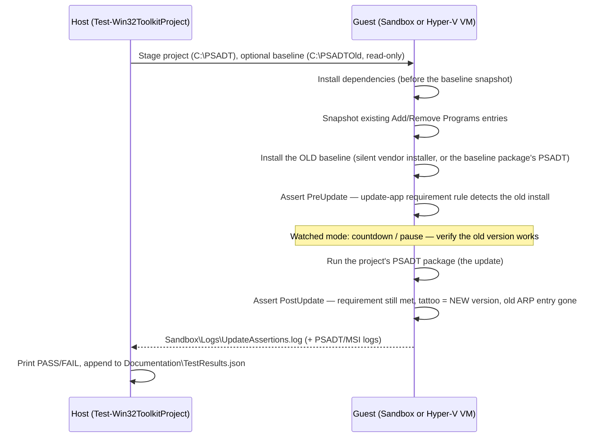

# Testing packages

Before a package ever reaches a device, you can prove it installs, uninstalls, and updates cleanly — in a
disposable Windows guest, with real pass/fail assertions. The command that does this is
[Test-Win32ToolkitProject](reference/Test-Win32ToolkitProject.md); it can run standalone against any
existing project, or be chained onto a packaging run with `Invoke-Win32Toolkit -RunTest`.

Every test run ends with a recorded **PASS / FAIL / inconclusive** verdict in the project's
`Documentation\TestResults.json` — the same history the generated customer documentation reports.

## Test backends: Windows Sandbox vs Hyper-V VM

Tests run in one of two guest environments:

| | **Windows Sandbox** (default) | **Hyper-V test VM** (opt-in) |
|---|---|---|
| Setup needed | None (Windows feature) | One-time VM build — see [Hyper-V test VM](hyperv-vm.md) |
| Guest lifetime | Disposable — a fresh guest cold-boots for every run | Persistent VM, reverted to a warm checkpoint per run (faster) |
| Concurrency | One sandbox at a time (the toolkit waits up to 90 s for a previous one to close) | No single-instance limit from Sandbox |
| Unattended runs execute as | The sandbox's built-in admin user | **SYSTEM** — the same context Intune uses |

To make Hyper-V the default backend, set the `TestBackend` config value (stored in the toolkit's
per-user registry key):

```powershell
Set-ItemProperty -Path 'HKCU:\Software\CloudFlow\win32-toolkit' -Name TestBackend -Value 'HyperV'
```

You can also pick a backend for a single run with the `-Backend` parameter. Either way, if Hyper-V is
selected but not ready (not elevated, VM or checkpoint missing, no guest credential saved), the run
**falls back to Windows Sandbox with a warning** instead of failing. Documentation capture follows the
same backend choice.

## Watched vs unattended

Both backends run **watched** (interactive) by default: PSADT shows its normal GUI, and you get a
verification window — a 2-minute countdown dialog in the Sandbox, or a host-side pause on Hyper-V — to
click around in the freshly installed app before the test continues. In the Sandbox the guest window
stays open afterwards for manual inspection.

Pass `-Unattended` for silent, back-to-back automation:

- PSADT runs in `-DeployMode Silent` — no GUI, no countdown, no pauses.
- Under Sandbox, the guest **shuts itself down** after collecting logs, so a chained run (for example
  `-RunTest InstallUninstall, Update`) proceeds without anyone closing windows.

To make unattended the default per backend, set the `SandboxTestMode` and/or `HyperVTestMode` config
value to `Unattended` in the same registry key. An explicit `-Unattended` switch always overrides the
config. On a **non-interactive host** (CI pipeline, redirected stdin), the toolkit auto-selects
Unattended and prints a loud warning — interactive mode would block forever on prompts nobody can see.

> **Context caveat.** A Sandbox-unattended run executes as the sandbox's interactive admin user, while a
> HyperV-unattended run executes as **SYSTEM — the same context Intune's install uses on a real device**.
> The two verdicts are therefore *not equivalent evidence*: an app that behaves differently under SYSTEM
> (per-user shortcuts, HKCU writes, user profile paths) can pass in the Sandbox and still fail via
> Intune. The recorded outcome includes the backend and mode so you can tell them apart later. For the
> closest-to-Intune signal, use the Hyper-V backend unattended.

## The InstallUninstall scenario

To run it:

```powershell
Test-Win32ToolkitProject -ProjectPath 'C:\Win32Apps\Projects\Contoso\Git_x64_2.53.0' -Scenario InstallUninstall
```

What happens inside the guest, in order:

1. **Dependencies install first** — any winget or `project:` dependencies the project declares are
   staged into `Sandbox\Dependencies\` and installed silently before the app, the same order Intune
   uses on a real device.
2. **Install** — the project's `Invoke-AppDeployToolkit.ps1` runs (GUI in watched mode, silent in
   unattended).
3. **Assert: installed** — the guest checks that the app is *detected* using the same signal Intune's
   detection rule uses: the **install tattoo** (the registry key the package writes on success). If the
   install "succeeded" but the tattoo is missing, the test fails — exactly as Intune would report a
   failed install.
4. **Countdown / verification window** (watched mode only) — a 2-minute WinForms countdown with a Skip
   button (Sandbox), or the PSADT GUI plus a host pause (Hyper-V). Use it to launch the app and check it
   actually works.
5. **Uninstall** — `Invoke-AppDeployToolkit.ps1 -DeploymentType Uninstall`.
6. **Assert: uninstalled** — the detection signal must now be *gone*.
7. **Log collection** — PSADT and MSI logs are copied back to the project's `Sandbox\Logs\` folder for
   troubleshooting, whatever the outcome.

The host waits for the in-guest assertion log (`Sandbox\Logs\InstallAssertions.log`), prints a
**PASS/FAIL verdict**, and appends the outcome — scenario, backend, mode, verdict, timestamp — to
`Documentation\TestResults.json`. In watched Sandbox mode the guest stays open; closing it early before
the uninstall assertion leaves the verdict inconclusive.

<!-- SCREENSHOT: Windows Sandbox during an InstallUninstall run, with the 2-minute countdown dialog visible over the freshly installed app -->

## The Update scenario

The Update scenario proves the package can upgrade a machine that already has an **older version**
installed — the situation your update app meets in the field.

```powershell
Test-Win32ToolkitProject -ProjectPath 'C:\Win32Apps\Projects\Contoso\Git_x64_2.53.0' -Scenario Update -VersionsBack 1
```

### Choosing the old-version baseline

| Baseline source | How | Best for |
|---|---|---|
| **winget** (default) | The toolkit reads the package ID from the project's YAML, lists older winget versions, and downloads one to `Sandbox\OldVersion\` — picked interactively, or via `-VersionsBack` / `-SpecificVersion`. Silent install switches come from the downloaded manifest; when none are published, installer-type defaults apply (NSIS `/S` · Inno `/VERYSILENT /NORESTART /SP-` · WiX/Burn `/quiet /norestart` · MSI `/qn /norestart`), and only for an **unknown/typeless installer** — where `/S` is a guess — a warning tells you to watch the run. | winget-sourced apps |
| **A local packaged project** | `-BaselineProject 'Contoso\Git_x64_2.52.0'` (a friendly `<Template>\<Name>` reference under `Projects\`) or `-BaselineProjectPath` (full path). The baseline package is mapped **read-only** into the guest at `C:\PSADTOld` (its raw `Projects\` copy is never modified) and installed via *its own* PSADT script. | Manual (non-winget) apps, which have no winget version history — and proving the **tattoo-overwrite** path: the old package writes its tattoo, and the new one must replace it |

### What the run does



The **requirement-rule assertion** is the key extra: before the update runs, the guest executes the same
requirement script the update app will ship with, and asserts it *detects the real old install*. After
the update it asserts the rule is still met and the install tattoo now holds the **new** version (the
Intune detection rule). If the project has no usable requirement rule yet, pass
`-SkipRequirementCheck` — those assertions report SKIP while the tattoo assertion still runs.

Assertion results stream back to `Sandbox\Logs\UpdateAssertions.log`; the command reports the verdict
and records it in `TestResults.json`, like the InstallUninstall scenario.

<!-- SCREENSHOT: Host console showing the Update test verdict block (PASS with the requirement and tattoo assertions listed) -->

## What is "the update app"?

The toolkit publishes each packaged version to Intune **twice**:

1. The **install app** — assigned normally; its detection rule is the install tattoo at the exact
   version.
2. The **update app** — the *same* `.intunewin`, published as a second app whose **requirement rule** is
   a presence check: it is only *applicable* on devices where the app is **already installed** (any
   version). Devices without the app ignore it; devices with an older version see the requirement met
   and the detection rule (exact new version) unmet — so they update.

The requirement rule deliberately checks *presence*, not *version*: the detection rule already pins the
exact version, and a "version ≥ new" requirement would make the update applicable only once it is
already up to date. Presence is established from exact, version-stable signals — the install tattoo key,
the MSI UpgradeCode or product code, or an exact Add/Remove-Programs name — and publishing refuses to
create an update app when no reliable signal exists (it would otherwise target every device).

The Update test scenario above is precisely a rehearsal of this app: it proves the requirement rule
detects a genuine old install and that the update leaves the device in the detected, new-version state.
See [Publish-Win32ToolkitIntuneApp](reference/Publish-Win32ToolkitIntuneApp.md) for publishing it.

## Chaining tests onto a packaging run

You don't have to test as a separate step. [Invoke-Win32Toolkit](reference/Invoke-Win32Toolkit.md)
accepts `-RunTest` with one or both scenarios, executed right after the project is built:

```powershell
# Package, then run both scenarios back-to-back (unattended config recommended)
Invoke-Win32Toolkit -Id 'Git.Git' -Architecture x64 -Force -RunTest InstallUninstall, Update -UpdateVersionsBack 1
```

For the chained Update scenario, `-UpdateVersionsBack` picks the baseline N releases back and
`-UpdateSpecificVersion` pins an exact one (it wins when both are given); omit both to pick
interactively. Chained runs benefit from the single-instance handling: the toolkit waits up to 90 s for
a previous sandbox to close before starting the next one, and unattended sandboxes shut themselves down,
so `InstallUninstall, Update` completes hands-off.
